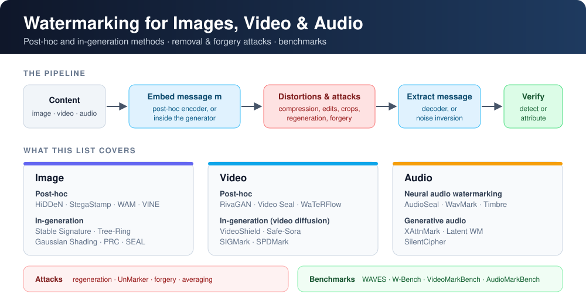

<div align="center">

<h1>Awesome Video/Image Watermarking</h1>

<p><b>A curated list of watermarking research for images, video and audio — from classic deep watermarking to watermarks for diffusion and autoregressive generators, plus the attacks and benchmarks that test them.</b></p>

<a href="https://github.com/SMSD75/awesome-watermarking/pulls"></a>


<a href="https://github.com/SMSD75/awesome-watermarking/commits/main"></a>
<a href="LICENSE"></a>
<a href="https://github.com/SMSD75/awesome-watermarking/stargazers"></a>

<br>



<p><b>Keywords:</b> <i>invisible watermarking · generative AI provenance · diffusion watermarking · video watermarking · audio watermarking · watermark removal · content authenticity</i></p>

<p><a href="#1-must-read-papers">Must-Read</a> · <a href="#2-paper-list">Paper List</a> · <a href="#3-papers-by-venue">By Venue</a> · <a href="#4-contributing">Contributing</a> · <a href="#5-citation">Citation</a></p>

</div>

## 🔥 News

- **[2026-10]** ✅ Full citation audit: every entry checked against arXiv / proceedings for title, venue, year and official code; list expanded to **154 papers** with new top-tier work (CVPR/ICCV/ECCV, NeurIPS/ICLR/ICML, USENIX Security, CCS, S&P, AAAI, ACM MM).
- **[2026-10]** 🚀 Launched with image, video and audio watermarking, including the latest **CVPR 2026**, **ICLR 2026** and **ICML 2026** papers.
- **[2026-10]** 🔊 Audio coverage: AudioSeal, WavMark, Timbre, AudioMarkNet (USENIX Sec), XAttnMark, GROOT, RAW-Bench and more.

> [!TIP]
> ⭐ marks foundational or highly influential work. Within each section, papers are ordered newest first. Contributions are welcome — see [Contributing](#4-contributing).

## 📑 Contents

- [1. Must-Read Papers](#1-must-read-papers)
- [2. Paper List](#2-paper-list)
  - [2.1 Foundations](#foundations)
  - [2.2 Image — Post-hoc Watermarking](#image-post-hoc)
  - [2.3 Image — In-Generation Watermarking](#image-in-generation)
    - [2.3.1 Fine-tuning / Weight-based](#fine-tuning--weight-based)
    - [2.3.2 Initial-noise / Semantic (Training-free)](#initial-noise--semantic)
    - [2.3.3 Autoregressive & Other Generators](#autoregressive--other-generators)
  - [2.4 Video Watermarking](#video)
    - [2.4.1 Post-hoc Video](#post-hoc-video)
    - [2.4.2 In-generation (Video Diffusion)](#in-generation-video-diffusion)
  - [2.5 Audio Watermarking](#audio)
  - [2.6 Attacks: Removal, Forgery & Spoofing](#attacks)
  - [2.7 Benchmarks, Surveys & Toolkits](#benchmarks)
- [3. Papers by Venue](#3-papers-by-venue)
- [4. Contributing](#4-contributing)
- [5. Citation](#5-citation)
- [Star History](#star-history)

## 1. Must-Read Papers

A starting point: the papers that defined each line of work.

| Title | Venue | Year | Code | Topic |
|:------|:-----:|:----:|:----:|:-----:|
| [**Secure Spread Spectrum Watermarking for Multimedia**](https://doi.org/10.1109/83.650120) | IEEE TIP | 1997 | — | Foundations |
|  <br> [**HiDDeN: Hiding Data With Deep Networks**](https://arxiv.org/abs/1807.09937) | ECCV | 2018 | [GitHub](https://github.com/jirenz/HiDDeN) | Foundations |
|  <br> [**StegaStamp: Invisible Hyperlinks in Physical Photographs**](https://arxiv.org/abs/1904.05343) | CVPR | 2020 | [GitHub](https://github.com/tancik/StegaStamp) | Foundations |
|  <br> [**Artificial Fingerprinting for Generative Models: Rooting Deepfake Attribution in Training Data**](https://arxiv.org/abs/2007.08457) | ICCV | 2021 | [GitHub](https://github.com/ningyu1991/ArtificialGANFingerprints) | Foundations |
|  <br> [**Towards Blind Watermarking: Combining Invertible and Non-invertible Mechanisms (CIN)**](https://arxiv.org/abs/2212.12678) | ACM MM | 2022 | [GitHub](https://github.com/rmpku/CIN) | Image · Post-hoc |
|  <br> [**EditGuard: Versatile Image Watermarking for Tamper Localization and Copyright Protection**](https://arxiv.org/abs/2312.08883) | CVPR | 2024 | [GitHub](https://github.com/xuanyuzhang21/EditGuard) | Image · Post-hoc |
|  <br> [**Watermark Anything with Localized Messages (WAM)**](https://arxiv.org/abs/2411.07231) | ICLR | 2025 | [GitHub](https://github.com/facebookresearch/watermark-anything) | Image · Post-hoc |
| [**SynthID-Image: Image watermarking at internet scale**](https://arxiv.org/abs/2510.09263) | arXiv | 2025 | — | Image · Post-hoc |
|  <br> [**Responsible Disclosure of Generative Models Using Scalable Fingerprinting**](https://arxiv.org/abs/2012.08726) | ICLR | 2022 | [GitHub](https://github.com/ningyu1991/ScalableGANFingerprints) | Image · In-gen |
|  <br> [**The Stable Signature: Rooting Watermarks in Latent Diffusion Models**](https://arxiv.org/abs/2303.15435) | ICCV | 2023 | [GitHub](https://github.com/facebookresearch/stable_signature) | Image · In-gen |
|  <br> [**Tree-Rings Watermarks: Invisible Fingerprints for Diffusion Images (Tree-Ring)**](https://arxiv.org/abs/2305.20030) | NeurIPS | 2023 | [GitHub](https://github.com/YuxinWenRick/tree-ring-watermark) | Image · In-gen |
|  <br> [**Gaussian Shading: Provable Performance-Lossless Image Watermarking for Diffusion Models**](https://arxiv.org/abs/2404.04956) | CVPR | 2024 | [GitHub](https://github.com/bsmhmmlf/Gaussian-Shading) | Image · In-gen |
|  <br> [**A Watermark-Conditioned Diffusion Model for IP Protection (WaDiff)**](https://arxiv.org/abs/2403.10893) | ECCV | 2024 | [GitHub](https://github.com/rmin2000/WaDiff) | Image · In-gen |
|  <br> [**An Undetectable Watermark for Generative Image Models (PRC Watermark)**](https://arxiv.org/abs/2410.07369) | ICLR | 2025 | [GitHub](https://github.com/XuandongZhao/PRC-Watermark) | Image · In-gen |
|  <br> [**Robust Invisible Video Watermarking with Attention (RivaGAN)**](https://arxiv.org/abs/1909.01285) | arXiv | 2019 | [GitHub](https://github.com/DAI-Lab/RivaGAN) | Video |
|  <br> [**Video Seal: Open and Efficient Video Watermarking**](https://arxiv.org/abs/2412.09492) | arXiv | 2024 | [GitHub](https://github.com/facebookresearch/videoseal) | Video |
|  <br> [**VideoShield: Regulating Diffusion-based Video Generation Models via Watermarking**](https://arxiv.org/abs/2501.14195) | ICLR | 2025 | [GitHub](https://github.com/hurunyi/VideoShield) | Video |
|  <br> [**Proactive Detection of Voice Cloning with Localized Watermarking (AudioSeal)**](https://arxiv.org/abs/2401.17264) | ICML | 2024 | [GitHub](https://github.com/facebookresearch/audioseal) | Audio |
| [**AudioMarkNet: Audio Watermarking for Deepfake Speech Detection**](https://www.usenix.org/conference/usenixsecurity25/presentation/zong) | USENIX Security | 2025 | [GitHub](https://zenodo.org/records/14722182) | Audio |
|  <br> [**Invisible Image Watermarks Are Provably Removable Using Generative AI**](https://arxiv.org/abs/2306.01953) | NeurIPS | 2024 | [GitHub](https://github.com/XuandongZhao/WatermarkAttacker) | Attack |
|  <br> [**Watermarks in the Sand: Impossibility of Strong Watermarking for Language Models**](https://arxiv.org/abs/2311.04378) | ICML | 2024 | [GitHub](https://github.com/hlzhang109/impossibility-watermark) | Attack |
|  <br> [**UnMarker: A Universal Attack on Defensive Image Watermarking**](https://arxiv.org/abs/2405.08363) | IEEE S&P | 2025 | [GitHub](https://github.com/andrekassis/ai-watermark) | Attack |
| [**A Crack in the Bark: Leveraging Public Knowledge to Remove Tree-Ring Watermarks**](https://www.usenix.org/conference/usenixsecurity25/presentation/lin-junhua) | USENIX Security | 2025 | [GitHub](https://doi.org/10.5281/zenodo.15595719) | Attack |
|  <br> [**WAVES: Benchmarking the Robustness of Image Watermarks**](https://arxiv.org/abs/2401.08573) | ICML | 2024 | [GitHub](https://github.com/umd-huang-lab/WAVES) | Benchmark |

## 2. Paper List

<a id="foundations"></a>

### 2.1 Foundations

+ ⭐ **Secure Spread Spectrum Watermarking for Multimedia** [[IEEE TIP 1997](https://doi.org/10.1109/83.650120)]
+ ⭐ **HiDDeN: Hiding Data With Deep Networks** [[ECCV 2018](https://arxiv.org/abs/1807.09937)] [[Code](https://github.com/jirenz/HiDDeN)] 
+ ⭐ **StegaStamp: Invisible Hyperlinks in Physical Photographs** [[CVPR 2020](https://arxiv.org/abs/1904.05343)] [[Code](https://github.com/tancik/StegaStamp)] 
+ **Distortion Agnostic Deep Watermarking** [[CVPR 2020](https://arxiv.org/abs/2001.04580)]
+ ⭐ **Artificial Fingerprinting for Generative Models: Rooting Deepfake Attribution in Training Data** [[ICCV 2021](https://arxiv.org/abs/2007.08457)] [[Code](https://github.com/ningyu1991/ArtificialGANFingerprints)] 
+ **MBRS: Enhancing Robustness of DNN-based Watermarking by Mini-Batch of Real and Simulated JPEG Compression** [[ACM MM 2021](https://arxiv.org/abs/2108.08211)] [[Code](https://github.com/jzyustc/MBRS)] 
+ **Watermarking Images in Self-Supervised Latent Spaces** [[ICASSP 2022](https://arxiv.org/abs/2112.09581)] [[Code](https://github.com/facebookresearch/ssl_watermarking)] 

<p align="right"><a href="#-contents">⬆ back to top</a></p>

<a id="image-post-hoc"></a>

### 2.2 Image — Post-hoc Watermarking

+ **Watermark-based Attribution of AI-Generated Content** [[ICLR 2026](https://arxiv.org/abs/2404.04254)]
+ **TrustMark: Robust Watermarking and Watermark Removal for Arbitrary Resolution Images** [[ICCV 2025](https://arxiv.org/abs/2311.18297)] [[Code](https://github.com/adobe/trustmark)] 
+ ⭐ **Watermark Anything with Localized Messages (WAM)** [[ICLR 2025](https://arxiv.org/abs/2411.07231)] [[Code](https://github.com/facebookresearch/watermark-anything)] 
+ **Robust Watermarking Using Generative Priors Against Image Editing: From Benchmarking to Advances (VINE, W-Bench)** [[ICLR 2025](https://arxiv.org/abs/2410.18775)] [[Code](https://github.com/Shilin-LU/VINE)] 
+ **InvisMark: Invisible and Robust Watermarking for AI-generated Image Provenance** [[WACV 2025](https://arxiv.org/abs/2411.07795)] [[Code](https://github.com/microsoft/InvisMark)] 
+ ⭐ **SynthID-Image: Image watermarking at internet scale** [[arXiv 2025](https://arxiv.org/abs/2510.09263)]
+ **Pixel Seal: Adversarial-only training for invisible image and video watermarking** [[arXiv 2025](https://arxiv.org/abs/2512.16874)] [[Code](https://github.com/facebookresearch/videoseal)] 
+ **WaterFlow: Learning Fast & Robust Watermarks using Stable Diffusion** [[ICLR 2025 Workshop (WMARK)](https://arxiv.org/abs/2504.12354)]
+ **OmniGuard: Hybrid Manipulation Localization via Augmented Versatile Deep Image Watermarking** [[CVPR 2025](https://arxiv.org/abs/2412.01615)] [[Code](https://github.com/xuanyuzhang21/OmniGuard)] 
+ **Watermarking One for All: A Robust Watermarking Scheme Against Partial Image Theft (WOFA)** [[CVPR 2025](https://openaccess.thecvf.com/content/CVPR2025/html/Liu_Watermarking_One_for_All_A_Robust_Watermarking_Scheme_Against_Partial_CVPR_2025_paper.html)]
+ **Mask Image Watermarking (MaskWM)** [[NeurIPS 2025](https://arxiv.org/abs/2504.12739)] [[Code](https://github.com/hurunyi/MaskWM)] 
+ **Ultra-high Resolution Watermarking Framework Resistant to Extreme Cropping and Scaling** [[NeurIPS 2025](https://openreview.net/forum?id=JyxsfFEiua)]
+ **Attack-Resilient Image Watermarking Using Stable Diffusion (ZoDiac)** [[NeurIPS 2024](https://arxiv.org/abs/2401.04247)] [[Code](https://github.com/zhanglijun95/ZoDiac)] 
+ ⭐ **EditGuard: Versatile Image Watermarking for Tamper Localization and Copyright Protection** [[CVPR 2024](https://arxiv.org/abs/2312.08883)] [[Code](https://github.com/xuanyuzhang21/EditGuard)] 
+ **Robust-Wide: Robust Watermarking against Instruction-driven Image Editing** [[ECCV 2024](https://arxiv.org/abs/2402.12688)] [[Code](https://github.com/hurunyi/Robust-Wide)] 
+ **Certifiably Robust Image Watermark** [[ECCV 2024](https://arxiv.org/abs/2407.04086)] [[Code](https://github.com/zhengyuan-jiang/Watermark-Library)] 
+ **RAW: A Robust and Agile Plug-and-Play Watermark Framework for AI-Generated Images with Provable Guarantees** [[NeurIPS 2024](https://openreview.net/forum?id=ogaeChzbKu)] [[Code](https://github.com/jeremyxianx/RAWatermark)] 
+ **FreqMark: Invisible Image Watermarking via Frequency Based Optimization in Latent Space** [[NeurIPS 2024](https://openreview.net/forum?id=01s5ODIHKd)]
+ **FIN: Flow-based Robust Watermarking with Invertible Noise Layer for Black-box Distortions** [[AAAI 2023](https://ojs.aaai.org/index.php/AAAI/article/view/25633)] [[Code](https://github.com/QQiuyp/FIN)] 
+ **RoSteALS: Robust Steganography using Autoencoder Latent Space** [[CVPR 2023 Workshop](https://arxiv.org/abs/2304.03400)] [[Code](https://github.com/TuBui/RoSteALS)] 
+ **Practical Deep Dispersed Watermarking with Synchronization and Fusion (DWSF)** [[ACM MM 2023](https://arxiv.org/abs/2310.14532)] [[Code](https://github.com/bytedance/DWSF)] 
+ **SepMark: Deep Separable Watermarking for Unified Source Tracing and Deepfake Detection** [[ACM MM 2023](https://arxiv.org/abs/2305.06321)] [[Code](https://github.com/sh1newu/SepMark)] 
+ ⭐ **Towards Blind Watermarking: Combining Invertible and Non-invertible Mechanisms (CIN)** [[ACM MM 2022](https://arxiv.org/abs/2212.12678)] [[Code](https://github.com/rmpku/CIN)] 
+ **PIMoG: An Effective Screen-shooting Noise-Layer Simulation for Deep-Learning-Based Watermarking Network** [[ACM MM 2022](https://dl.acm.org/doi/10.1145/3503161.3548049)] [[Code](https://github.com/FangHanNUS/PIMoG-An-Effective-Screen-shooting-Noise-Layer-Simulation-for-Deep-Learning-Based-Watermarking-Netw)] 
+ **ReDMark: Framework for Residual Diffusion Watermarking Based on Deep Networks** [[ESWA 2020](https://arxiv.org/abs/1810.07248)]
+ **A Novel Two-stage Separable Deep Learning Framework for Practical Blind Watermarking (TSDL)** [[ACM MM 2019](https://doi.org/10.1145/3343031.3351025)]

<p align="right"><a href="#-contents">⬆ back to top</a></p>

<a id="image-in-generation"></a>

### 2.3 Image — In-Generation Watermarking

<a id="fine-tuning--weight-based"></a>

#### 2.3.1 Fine-tuning / Weight-based

+ **MSAT-LDM: Toward Transferable High-Fidelity Watermarking for Latent Diffusion Model via Modular Self-Augmented Training** [[AAAI 2026](https://ojs.aaai.org/index.php/AAAI/article/view/40921)]
+ **GenPTW: Latent Image Watermarking for Provenance Tracing and Tamper Localization** [[AAAI 2026](https://arxiv.org/abs/2504.19567)]
+ **Learning to Watermark in the Latent Space of Generative Models (DistSeal)** [[ICML 2026](https://arxiv.org/abs/2601.16140)]
+ **SleeperMark: Towards Robust Watermark against Fine-Tuning Text-to-image Diffusion Models** [[CVPR 2025](https://arxiv.org/abs/2412.04852)] [[Code](https://github.com/taco-group/SleeperMark)] 
+ **WMAdapter: Adding WaterMark Control to Latent Diffusion Models** [[ICML 2025](https://arxiv.org/abs/2406.08337)]
+ **Your Text Encoder Can Be An Object-Level Watermarking Controller** [[ICCV 2025](https://arxiv.org/abs/2503.11945)]
+ **RoMa: A Robust Model Watermarking Scheme for Protecting IP in Diffusion Models** [[NeurIPS 2025](https://openreview.net/forum?id=me2vIZfgQf)] [[Code](https://github.com/xiekks/RoMa)] 
+ **WOUAF: Weight Modulation for User Attribution and Fingerprinting in Text-to-Image Diffusion Models** [[CVPR 2024](https://arxiv.org/abs/2306.04744)] [[Code](https://github.com/kylemin/WOUAF)] 
+ **AquaLoRA: Toward White-box Protection for Customized Stable Diffusion Models via Watermark LoRA** [[ICML 2024](https://arxiv.org/abs/2405.11135)] [[Code](https://github.com/Georgefwt/AquaLoRA)] 
+ **ProMark: Proactive Diffusion Watermarking for Causal Attribution** [[CVPR 2024](https://arxiv.org/abs/2403.09914)]
+ ⭐ **A Watermark-Conditioned Diffusion Model for IP Protection (WaDiff)** [[ECCV 2024](https://arxiv.org/abs/2403.10893)] [[Code](https://github.com/rmin2000/WaDiff)] 
+ **LaWa: Using Latent Space for In-Generation Image Watermarking** [[ECCV 2024](https://arxiv.org/abs/2408.05868)] [[Code](https://github.com/vbdi/LaWa)] 
+ **Safe-SD: Safe and Traceable Stable Diffusion with Text Prompt Trigger for Invisible Generative Watermarking** [[ACM MM 2024](https://arxiv.org/abs/2407.13188)]
+ ⭐ **The Stable Signature: Rooting Watermarks in Latent Diffusion Models** [[ICCV 2023](https://arxiv.org/abs/2303.15435)] [[Code](https://github.com/facebookresearch/stable_signature)] 
+ **A Recipe for Watermarking Diffusion Models** [[arXiv 2023](https://arxiv.org/abs/2303.10137)] [[Code](https://github.com/yunqing-me/WatermarkDM)] 
+ **PTW: Pivotal Tuning Watermarking for Pre-Trained Image Generators** [[USENIX Security 2023](https://arxiv.org/abs/2304.07361)] [[Code](https://github.com/nilslukas/gan-watermark)] 
+ ⭐ **Responsible Disclosure of Generative Models Using Scalable Fingerprinting** [[ICLR 2022](https://arxiv.org/abs/2012.08726)] [[Code](https://github.com/ningyu1991/ScalableGANFingerprints)] 
+ **Protecting Intellectual Property of Generative Adversarial Networks from Ambiguity Attacks** [[CVPR 2021](https://arxiv.org/abs/2102.04362)] [[Code](https://github.com/dingsheng-ong/ipr-gan)] 

<a id="initial-noise--semantic"></a>

#### 2.3.2 Initial-noise / Semantic (Training-free)

+ **OptMark: Robust Multi-bit Diffusion Watermarking via Inference Time Optimization** [[AAAI 2026](https://arxiv.org/abs/2508.21727)] [[Project](https://jiazheng-xing.github.io/optmark-home)]
+ **Guidance Watermarking for Diffusion Models** [[ICLR 2026](https://arxiv.org/abs/2509.22126)]
+ **Spherical Watermark: Encryption-Free, Lossless Watermarking for Diffusion Models** [[ICLR 2026](https://openreview.net/forum?id=2eAGrunxVz)]
+ **MaxMark: High-Capacity Diffusion-Native Watermarking via Robust and Invertible Latent Embedding** [[CVPR 2026](https://openaccess.thecvf.com/content/CVPR2026/html/Chang_MaxMark_High-Capacity_Diffusion-Native_Watermarking_via_Robust_and_Invertible_Latent_Embedding_CVPR_2026_paper.html)]
+ **Luminark: Training-free, Probabilistically-Certified Watermarking for General Vision Generative Models** [[arXiv 2026](https://arxiv.org/abs/2601.01085)]
+ **SERUM: Simple, Efficient, Robust, and Unifying Marking for Diffusion-based Image Generation** [[ICLR 2026](https://openreview.net/forum?id=AiBUm6iKBf)] [[Code](https://github.com/Hubizon/serum)] 
+ **NoisePrints: Distortion-Free Watermarks for Authorship in Private Diffusion Models** [[ICLR 2026](https://openreview.net/forum?id=gwHCXvPDBd)]
+ **SemBind: Binding Diffusion Watermarks to Semantics Against Black-Box Forgery Attacks** [[ICML 2026](https://openreview.net/forum?id=Sva22o2fRs)] [[Code](https://github.com/XinZhang1999/SemBind)] 
+ ⭐ **An Undetectable Watermark for Generative Image Models (PRC Watermark)** [[ICLR 2025](https://arxiv.org/abs/2410.07369)] [[Code](https://github.com/XuandongZhao/PRC-Watermark)] 
+ **Hidden in the Noise: Two-Stage Robust Watermarking for Images (WIND)** [[ICLR 2025](https://arxiv.org/abs/2412.04653)] [[Code](https://github.com/Kasraarabi/Hidden-in-the-Noise)] 
+ **GaussMarker: Robust Dual-Domain Watermark for Diffusion Models** [[ICML 2025](https://arxiv.org/abs/2506.11444)]
+ **SEAL: Semantic Aware Image Watermarking** [[ICCV 2025](https://arxiv.org/abs/2503.12172)] [[Code](https://github.com/Kasraarabi/SEAL)] 
+ **TAG-WM: Tamper-Aware Generative Image Watermarking via Diffusion Inversion Sensitivity** [[ICCV 2025](https://arxiv.org/abs/2506.23484)] [[Code](https://github.com/Suchenl/TAG-WM)] 
+ **Shallow Diffuse: Robust and Invisible Watermarking through Low-Dim Subspaces in Diffusion Models** [[NeurIPS 2025](https://arxiv.org/abs/2410.21088)] [[Code](https://github.com/liwd190019/Shallow-Diffuse)] 
+ **MaXsive: High-Capacity and Robust Training-Free Generative Image Watermarking in Diffusion Models** [[ACM MM 2025](https://arxiv.org/abs/2507.21195)]
+ **Semantic Watermarking Reinvented: Enhancing Robustness and Generation Quality with Fourier Integrity (SFWMark)** [[ICCV 2025](https://arxiv.org/abs/2509.07647)] [[Code](https://github.com/thomas11809/SFWMark)] 
+ **T2SMark: Balancing Robustness and Diversity in Noise-as-Watermark for Diffusion Models** [[NeurIPS 2025](https://openreview.net/forum?id=EXqp8sA37r)]
+ ⭐ **Gaussian Shading: Provable Performance-Lossless Image Watermarking for Diffusion Models** [[CVPR 2024](https://arxiv.org/abs/2404.04956)] [[Code](https://github.com/bsmhmmlf/Gaussian-Shading)] 
+ **Rethinking Tree-Ring Watermarking for Enhanced Multi-Key Identification (RingID)** [[ECCV 2024](https://arxiv.org/abs/2404.14055)] [[Code](https://github.com/showlab/RingID)] 
+ **ROBIN: Robust and Invisible Watermarks for Diffusion Models with Adversarial Optimization** [[NeurIPS 2024](https://arxiv.org/abs/2411.03862)] [[Code](https://github.com/Hannah1102/ROBIN)] 
+ ⭐ **Tree-Rings Watermarks: Invisible Fingerprints for Diffusion Images (Tree-Ring)** [[NeurIPS 2023](https://arxiv.org/abs/2305.20030)] [[Code](https://github.com/YuxinWenRick/tree-ring-watermark)] 

<a id="autoregressive--other-generators"></a>

#### 2.3.3 Autoregressive & Other Generators

+ **Watermarking Autoregressive Image Generation** [[NeurIPS 2025](https://arxiv.org/abs/2506.16349)] [[Code](https://github.com/facebookresearch/wmar)] 
+ **A Watermark for Auto-Regressive Image Generation Models** [[arXiv 2025](https://arxiv.org/abs/2506.11371)]
+ **BitMark: Watermarking Bitwise Autoregressive Image Generative Models** [[NeurIPS 2025](https://openreview.net/forum?id=VSir0FzFnP)] [[Code](https://github.com/sprintml/BitMark)] 

<p align="right"><a href="#-contents">⬆ back to top</a></p>

<a id="video"></a>

### 2.4 Video Watermarking

<a id="post-hoc-video"></a>

#### 2.4.1 Post-hoc Video

+ **WaTeRFlow: Watermark Temporal Robustness via Flow Consistency** [[CVPR 2026](https://arxiv.org/abs/2512.19048)]
+ **DVMark: A Deep Multiscale Framework for Video Watermarking** [[IEEE TIP 2025](https://arxiv.org/abs/2104.12734)]
+ **Pixel Seal: Adversarial-only training for invisible image and video watermarking** [[arXiv 2025](https://arxiv.org/abs/2512.16874)] [[Code](https://github.com/facebookresearch/videoseal)] 
+ **I2VWM: Robust Watermarking for Image to Video Generation** [[arXiv 2025](https://arxiv.org/abs/2509.17773)] [[Code](https://github.com/MrCrims/LoT-Pass-Long-term-robust-Image-Watermarking-for-Image-to-Video-Generation)] 
+ **DINVMark: A Deep Invertible Network for Video Watermarking** [[arXiv 2025](https://arxiv.org/abs/2509.17416)]
+ ⭐ **Video Seal: Open and Efficient Video Watermarking** [[arXiv 2024](https://arxiv.org/abs/2412.09492)] [[Code](https://github.com/facebookresearch/videoseal)] 
+ **V2A-Mark: Versatile Deep Visual-Audio Watermarking for Manipulation Localization and Copyright Protection** [[arXiv 2024](https://arxiv.org/abs/2404.16824)]
+ **ItoV: Efficiently Adapting Deep Learning-based Image Watermarking to Video Watermarking** [[arXiv 2023](https://arxiv.org/abs/2305.02781)]
+ **A Novel Deep Video Watermarking Framework with Enhanced Robustness to H.264/AVC Compression (REVMark)** [[ACM MM 2023](https://doi.org/10.1145/3581783.3612270)]
+ ⭐ **Robust Invisible Video Watermarking with Attention (RivaGAN)** [[arXiv 2019](https://arxiv.org/abs/1909.01285)] [[Code](https://github.com/DAI-Lab/RivaGAN)] 

<a id="in-generation-video-diffusion"></a>

#### 2.4.2 In-generation (Video Diffusion)

+ **LVMark: Robust Watermark for Latent Video Diffusion Models** [[IEEE TIFS 2026](https://arxiv.org/abs/2412.09122)]
+ **SPDMark: Selective Parameter Displacement for Robust Video Watermarking** [[CVPR 2026](https://arxiv.org/abs/2512.12090)]
+ **SIGMark: Scalable In-Generation Watermark with Blind Extraction for Video Diffusion** [[ICLR 2026](https://arxiv.org/abs/2603.02882)] [[Code](https://github.com/JeremyZhao1998/SIGMark-release)] 
+ **SKeDA: A Generative Watermarking Framework for Text-to-video Diffusion Models** [[arXiv 2026](https://arxiv.org/abs/2603.00194)]
+ ⭐ **VideoShield: Regulating Diffusion-based Video Generation Models via Watermarking** [[ICLR 2025](https://arxiv.org/abs/2501.14195)] [[Code](https://github.com/hurunyi/VideoShield)] 
+ **Safe-Sora: Safe Text-to-Video Generation via Graphical Watermarking** [[NeurIPS 2025](https://arxiv.org/abs/2505.12667)] [[Code](https://github.com/Sugewud/Safe-Sora)] 
+ **VideoMark: A Distortion-Free Robust Watermarking Framework for Video Diffusion Models** [[arXiv 2025](https://arxiv.org/abs/2504.16359)] [[Code](https://github.com/KYRIE-LI11/VideoMark)] 
+ **VidStamp: A Temporally-Aware Watermark for Ownership and Integrity in Video Diffusion Models** [[arXiv 2025](https://arxiv.org/abs/2505.01406)] [[Code](https://github.com/SPIN-UMass/VidStamp)] 
+ **Video Signature: Implicit Watermarking for Video Diffusion Models (VidSig)** [[arXiv 2025](https://arxiv.org/abs/2506.00652)]

<p align="right"><a href="#-contents">⬆ back to top</a></p>

<a id="audio"></a>

### 2.5 Audio Watermarking

+ **Yours or Mine? Overwriting Attacks Against Neural Audio Watermarking** [[AAAI 2026](https://ojs.aaai.org/index.php/AAAI/article/view/39997)]
+ **Self Voice Conversion as an Attack against Neural Audio Watermarking** [[arXiv 2026](https://arxiv.org/abs/2601.20432)]
+ **Latent Watermarking of Audio Generative Models** [[ICASSP 2025](https://arxiv.org/abs/2409.02915)]
+ **XAttnMark: Learning Robust Audio Watermarking with Cross-Attention** [[ICML 2025](https://arxiv.org/abs/2502.04230)] [[Project](https://liuyixin-louis.github.io/xattnmark/)]
+ **SoK: How Robust is Audio Watermarking in Generative AI Models?** [[arXiv 2025](https://arxiv.org/abs/2503.19176)] [[Project](https://sokaudiowm.github.io/)]
+ **Speech Watermarking with Discrete Intermediate Representations (DiscreteWM)** [[AAAI 2025](https://ojs.aaai.org/index.php/AAAI/article/view/34600)]
+ **Audio Codec Augmentation for Robust Collaborative Watermarking of Speech Synthesis** [[ICASSP 2025](https://doi.org/10.1109/ICASSP49660.2025.10888976)]
+ ⭐ **AudioMarkNet: Audio Watermarking for Deepfake Speech Detection** [[USENIX Security 2025](https://www.usenix.org/conference/usenixsecurity25/presentation/zong)] [[Code](https://zenodo.org/records/14722182)]
+ **Deep Audio Watermarks are Shallow: Limitations of Post-Hoc Watermarking Techniques for Speech** [[ICLR 2025 Workshop (WMARK)](https://arxiv.org/abs/2504.10782)]
+ **A Comprehensive Real-World Assessment of Audio Watermarking Algorithms: Will They Survive Neural Codecs? (RAW-Bench)** [[Interspeech 2025](https://arxiv.org/abs/2505.19663)] [[Code](https://github.com/SonyResearch/raw_bench)] 
+ **VoiceMark: Zero-Shot Voice Cloning-Resistant Watermarking Approach Leveraging Speaker-Specific Latents** [[Interspeech 2025](https://arxiv.org/abs/2505.21568)]
+ **Robust Distortion-Free Watermark for Autoregressive Audio Generation Models (Aligned-IS)** [[NeurIPS 2025](https://arxiv.org/abs/2510.21115)]
+ **Collaborative Watermarking for Adversarial Speech Synthesis** [[ICASSP 2024](https://arxiv.org/abs/2309.15224)] [[Code](https://github.com/ljuvela/CollaborativeWatermarking)] 
+ **Detecting Voice Cloning Attacks via Timbre Watermarking** [[NDSS 2024](https://arxiv.org/abs/2312.03410)] [[Code](https://github.com/TimbreWatermarking/TimbreWatermarking)] 
+ ⭐ **Proactive Detection of Voice Cloning with Localized Watermarking (AudioSeal)** [[ICML 2024](https://arxiv.org/abs/2401.17264)] [[Code](https://github.com/facebookresearch/audioseal)] 
+ **SilentCipher: Deep Audio Watermarking** [[Interspeech 2024](https://arxiv.org/abs/2406.03822)] [[Code](https://github.com/sony/silentcipher)] 
+ **AudioMarkBench: Benchmarking Robustness of Audio Watermarking** [[NeurIPS 2024 (D&B)](https://arxiv.org/abs/2406.06979)] [[Code](https://github.com/moyangkuo/AudioMarkBench)] 
+ **MaskMark: Robust Neural Watermarking for Real and Synthetic Speech** [[ICASSP 2024](https://interactiveaudiolab.github.io/assets/papers/oreilly_jin_su_pardo_watermark.pdf)]
+ **GROOT: Generating Robust Watermark for Diffusion-Model-Based Audio Synthesis** [[ACM MM 2024](https://arxiv.org/abs/2407.10471)]
+ **IDEAW: Robust Neural Audio Watermarking with Invertible Dual-Embedding** [[EMNLP 2024](https://aclanthology.org/2024.emnlp-main.258/)] [[Code](https://github.com/PecholaL/IDEAW)] 
+ **WMCodec: End-to-End Neural Speech Codec with Deep Watermarking for Authenticity Verification** [[arXiv 2024](https://arxiv.org/abs/2409.12121)]
+ **Watermarking Training Data of Music Generation Models** [[arXiv 2024](https://arxiv.org/abs/2412.08549)]
+ **WavMark: Watermarking for Audio Generation** [[arXiv 2023](https://arxiv.org/abs/2308.12770)] [[Code](https://github.com/wavmark/wavmark)] 
+ **DeAR: A Deep-Learning-Based Audio Re-recording Resilient Watermarking** [[AAAI 2023](https://ojs.aaai.org/index.php/AAAI/article/view/26550)]

<p align="right"><a href="#-contents">⬆ back to top</a></p>

<a id="attacks"></a>

### 2.6 Attacks: Removal, Forgery & Spoofing

+ **SHIFT: Stochastic Hidden-Trajectory Deflection for Removing Diffusion-based Watermark** [[arXiv 2026](https://arxiv.org/abs/2603.29742)] [[Code](https://github.com/ZhengGao-30/SHIFT-Watermark-Attack)] 
+ **MarkNull: Model-Agnostic Watermark Removal in AI-Generated Images via On-Manifold Latent Manipulation** [[arXiv 2026](https://arxiv.org/abs/2608.10166)] [[Code](https://doi.org/10.5281/zenodo.20201878)]
+ **RAVEN: Erasing Invisible Watermarks via Novel View Synthesis** [[CVPR 2026](https://arxiv.org/abs/2601.08832)]
+ **MarkSweep: A No-box Removal Attack on AI-Generated Image Watermarking via Noise Intensification and Frequency-aware Denoising** [[ICASSP 2026](https://arxiv.org/abs/2602.15364)]
+ **Removing the Watermark Is Not Enough: Forensic Stealth in Generative-AI Watermark Removal** [[arXiv 2026](https://arxiv.org/abs/2605.09203)]
+ ⭐ **UnMarker: A Universal Attack on Defensive Image Watermarking** [[IEEE S&P 2025](https://arxiv.org/abs/2405.08363)] [[Code](https://github.com/andrekassis/ai-watermark)] 
+ **Image Watermarks are Removable using Controllable Regeneration from Clean Noise (CtrlRegen)** [[ICLR 2025](https://arxiv.org/abs/2410.05470)] [[Code](https://github.com/yepengliu/CtrlRegen)] 
+ **A Transfer Attack to Image Watermarks** [[ICLR 2025](https://arxiv.org/abs/2403.15365)] [[Code](https://github.com/hifi-hyp/Watermark-Transfer-Attack)] 
+ **Black-Box Forgery Attacks on Semantic Watermarks for Diffusion Models** [[CVPR 2025](https://arxiv.org/abs/2412.03283)] [[Code](https://github.com/and-mill/semantic-forgery)] 
+ **Forging and Removing Latent-Noise Diffusion Watermarks Using a Single Image** [[arXiv 2025](https://arxiv.org/abs/2504.20111)] [[Code](https://github.com/anubhav1997/watermark_forgery_removal)] 
+ **On the Difficulty of Constructing a Robust and Publicly-Detectable Watermark** [[AISTATS 2025](https://arxiv.org/abs/2502.04901)]
+ ⭐ **A Crack in the Bark: Leveraging Public Knowledge to Remove Tree-Ring Watermarks** [[USENIX Security 2025](https://www.usenix.org/conference/usenixsecurity25/presentation/lin-junhua)] [[Code](https://doi.org/10.5281/zenodo.15595719)]
+ **WMCopier: Forging Invisible Watermarks on Arbitrary Images** [[NeurIPS 2025](https://arxiv.org/abs/2503.22330)] [[Code](https://github.com/holdrain/WMCopier)] 
+ **The Future Unmarked: Watermark Removal in AI-Generated Images via Next-Frame Prediction** [[NeurIPS 2025](https://papers.neurips.cc/paper_files/paper/2025/hash/b48405307576689bea14d221ccba73ae-Abstract-Conference.html)]
+ **Removal Attack and Defense on AI-generated Content Latent-based Watermarking** [[CCS 2025](https://arxiv.org/abs/2509.11745)]
+ **The Coding Limits of Robust Watermarking for Generative Models** [[arXiv 2025](https://arxiv.org/abs/2509.10577)]
+ **Optimization-Free Universal Watermark Forgery with Regenerative Diffusion Models** [[arXiv 2025](https://arxiv.org/abs/2506.06018)] [[Code](https://github.com/chaoyitud/PnP-Watermark-Forgery)] 
+ **Robustness of AI-Image Detectors: Fundamental Limits and Practical Attacks** [[ICLR 2024](https://arxiv.org/abs/2310.00076)] [[Code](https://github.com/mehrdadsaberi/watermark_robustness)] 
+ **Leveraging Optimization for Adaptive Attacks on Image Watermarks** [[ICLR 2024](https://arxiv.org/abs/2309.16952)]
+ ⭐ **Invisible Image Watermarks Are Provably Removable Using Generative AI** [[NeurIPS 2024](https://arxiv.org/abs/2306.01953)] [[Code](https://github.com/XuandongZhao/WatermarkAttacker)] 
+ **Can Simple Averaging Defeat Modern Watermarks?** [[NeurIPS 2024](https://arxiv.org/abs/2406.09026)] [[Code](https://github.com/showlab/watermark-steganalysis)] 
+ **Stable Signature is Unstable: Removing Image Watermark from Diffusion Models** [[arXiv 2024](https://arxiv.org/abs/2405.07145)]
+ ⭐ **Watermarks in the Sand: Impossibility of Strong Watermarking for Language Models** [[ICML 2024](https://arxiv.org/abs/2311.04378)] [[Code](https://github.com/hlzhang109/impossibility-watermark)] 
+ **The Brittleness of AI-Generated Image Watermarking Techniques: Examining Their Robustness Against Visual Paraphrasing Attacks** [[arXiv 2024](https://arxiv.org/abs/2408.10446)]
+ **Evading Watermark based Detection of AI-Generated Content** [[CCS 2023](https://arxiv.org/abs/2305.03807)] [[Code](https://github.com/zhengyuan-jiang/WEvade)] 
+ **Warfare: Breaking the Watermark Protection of AI-Generated Content** [[arXiv 2023](https://arxiv.org/abs/2310.07726)] [[Code](https://github.com/GuanlinLee/warfare)] 

<p align="right"><a href="#-contents">⬆ back to top</a></p>

<a id="benchmarks"></a>

### 2.7 Benchmarks, Surveys & Toolkits

+ **MarkDiffusion: An Open-Source Toolkit for Generative Watermarking of Latent Diffusion Models** [[JMLR 2026](https://arxiv.org/abs/2509.10569)] [[Code](https://github.com/THU-BPM/MarkDiffusion)] 
+ **SoK: Watermarking for AI-Generated Content** [[IEEE S&P 2025](https://arxiv.org/abs/2411.18479)]
+ **A Technical Report on "Erasing the Invisible": The 2024 NeurIPS Competition on Stress Testing Image Watermarks** [[NeurIPS 2025 (D&B)](https://openreview.net/forum?id=BeFjjyzWOJ)]
+ **VideoMarkBench: Benchmarking Robustness of Video Watermarking** [[arXiv 2025](https://arxiv.org/abs/2505.21620)] [[Code](https://github.com/zhengyuan-jiang/VideoMarkBench)] 
+ **Detection Limits and Statistical Separability of Tree Ring Watermarks in Rectified Flow-based Text-to-Image Generation Models** [[ICLR 2025 Workshop (WMARK)](https://arxiv.org/abs/2504.03850)] [[Code](https://github.com/dsgiitr/flux-watermarking)] 
+ **Security and Privacy on Generative Data in AIGC: A Survey** [[ACM CSUR 2025](https://doi.org/10.1145/3703626)]
+ **Watermarking for AI Content Detection: A Review on Text, Visual, and Audio Modalities** [[arXiv 2025](https://arxiv.org/abs/2504.03765)]
+ **Visual Watermarking in the Era of Diffusion Models: Advances and Challenges** [[arXiv 2025](https://arxiv.org/abs/2505.08197)]
+ **Secure and Robust Watermarking for AI-generated Images: A Comprehensive Survey** [[arXiv 2025](https://arxiv.org/abs/2510.02384)]
+ ⭐ **WAVES: Benchmarking the Robustness of Image Watermarks** [[ICML 2024](https://arxiv.org/abs/2401.08573)] [[Code](https://github.com/umd-huang-lab/WAVES)] 
+ **Evaluating Durability: Benchmark Insights into Multimodal Watermarking** [[arXiv 2024](https://arxiv.org/abs/2406.03728)] [[Project](https://mmwatermark-robustness.github.io/)]

<p align="right"><a href="#-contents">⬆ back to top</a></p>

## 3. Papers by Venue

Top-tier conference and journal papers from 2024 onward, grouped by venue. Click to expand.

<details>
<summary><b>CVPR 2026</b> (4)</summary>

+ [MaxMark: High-Capacity Diffusion-Native Watermarking via Robust and Invertible Latent Embedding](https://openaccess.thecvf.com/content/CVPR2026/html/Chang_MaxMark_High-Capacity_Diffusion-Native_Watermarking_via_Robust_and_Invertible_Latent_Embedding_CVPR_2026_paper.html) — *Image · In-gen*
+ [WaTeRFlow: Watermark Temporal Robustness via Flow Consistency](https://arxiv.org/abs/2512.19048) — *Video*
+ [SPDMark: Selective Parameter Displacement for Robust Video Watermarking](https://arxiv.org/abs/2512.12090) — *Video*
+ [RAVEN: Erasing Invisible Watermarks via Novel View Synthesis](https://arxiv.org/abs/2601.08832) — *Attack*

</details>

<details>
<summary><b>ICLR 2026</b> (6)</summary>

+ [Guidance Watermarking for Diffusion Models](https://arxiv.org/abs/2509.22126) — *Image · In-gen*
+ [Spherical Watermark: Encryption-Free, Lossless Watermarking for Diffusion Models](https://openreview.net/forum?id=2eAGrunxVz) — *Image · In-gen*
+ [SIGMark: Scalable In-Generation Watermark with Blind Extraction for Video Diffusion](https://arxiv.org/abs/2603.02882) [[Code](https://github.com/JeremyZhao1998/SIGMark-release)] — *Video*
+ [Watermark-based Attribution of AI-Generated Content](https://arxiv.org/abs/2404.04254) — *Image · Post-hoc*
+ [SERUM: Simple, Efficient, Robust, and Unifying Marking for Diffusion-based Image Generation](https://openreview.net/forum?id=AiBUm6iKBf) [[Code](https://github.com/Hubizon/serum)] — *Image · In-gen*
+ [NoisePrints: Distortion-Free Watermarks for Authorship in Private Diffusion Models](https://openreview.net/forum?id=gwHCXvPDBd) — *Image · In-gen*

</details>

<details>
<summary><b>ICML 2026</b> (2)</summary>

+ [Learning to Watermark in the Latent Space of Generative Models (DistSeal)](https://arxiv.org/abs/2601.16140) — *Image · In-gen*
+ [SemBind: Binding Diffusion Watermarks to Semantics Against Black-Box Forgery Attacks](https://openreview.net/forum?id=Sva22o2fRs) [[Code](https://github.com/XinZhang1999/SemBind)] — *Image · In-gen*

</details>

<details>
<summary><b>AAAI 2026</b> (4)</summary>

+ [MSAT-LDM: Toward Transferable High-Fidelity Watermarking for Latent Diffusion Model via Modular Self-Augmented Training](https://ojs.aaai.org/index.php/AAAI/article/view/40921) — *Image · In-gen*
+ [OptMark: Robust Multi-bit Diffusion Watermarking via Inference Time Optimization](https://arxiv.org/abs/2508.21727) — *Image · In-gen*
+ [GenPTW: Latent Image Watermarking for Provenance Tracing and Tamper Localization](https://arxiv.org/abs/2504.19567) — *Image · In-gen*
+ [Yours or Mine? Overwriting Attacks Against Neural Audio Watermarking](https://ojs.aaai.org/index.php/AAAI/article/view/39997) — *Audio*

</details>

<details>
<summary><b>ICASSP 2026</b> (1)</summary>

+ [MarkSweep: A No-box Removal Attack on AI-Generated Image Watermarking via Noise Intensification and Frequency-aware Denoising](https://arxiv.org/abs/2602.15364) — *Attack*

</details>

<details>
<summary><b>IEEE TIFS 2026</b> (1)</summary>

+ [LVMark: Robust Watermark for Latent Video Diffusion Models](https://arxiv.org/abs/2412.09122) — *Video*

</details>

<details>
<summary><b>JMLR 2026</b> (1)</summary>

+ [MarkDiffusion: An Open-Source Toolkit for Generative Watermarking of Latent Diffusion Models](https://arxiv.org/abs/2509.10569) [[Code](https://github.com/THU-BPM/MarkDiffusion)] — *Benchmark*

</details>

<details>
<summary><b>CVPR 2025</b> (4)</summary>

+ [SleeperMark: Towards Robust Watermark against Fine-Tuning Text-to-image Diffusion Models](https://arxiv.org/abs/2412.04852) [[Code](https://github.com/taco-group/SleeperMark)] — *Image · In-gen*
+ [Black-Box Forgery Attacks on Semantic Watermarks for Diffusion Models](https://arxiv.org/abs/2412.03283) [[Code](https://github.com/and-mill/semantic-forgery)] — *Attack*
+ [OmniGuard: Hybrid Manipulation Localization via Augmented Versatile Deep Image Watermarking](https://arxiv.org/abs/2412.01615) [[Code](https://github.com/xuanyuzhang21/OmniGuard)] — *Image · Post-hoc*
+ [Watermarking One for All: A Robust Watermarking Scheme Against Partial Image Theft (WOFA)](https://openaccess.thecvf.com/content/CVPR2025/html/Liu_Watermarking_One_for_All_A_Robust_Watermarking_Scheme_Against_Partial_CVPR_2025_paper.html) — *Image · Post-hoc*

</details>

<details>
<summary><b>ICCV 2025</b> (5)</summary>

+ [TrustMark: Robust Watermarking and Watermark Removal for Arbitrary Resolution Images](https://arxiv.org/abs/2311.18297) [[Code](https://github.com/adobe/trustmark)] — *Image · Post-hoc*
+ [SEAL: Semantic Aware Image Watermarking](https://arxiv.org/abs/2503.12172) [[Code](https://github.com/Kasraarabi/SEAL)] — *Image · In-gen*
+ [TAG-WM: Tamper-Aware Generative Image Watermarking via Diffusion Inversion Sensitivity](https://arxiv.org/abs/2506.23484) [[Code](https://github.com/Suchenl/TAG-WM)] — *Image · In-gen*
+ [Your Text Encoder Can Be An Object-Level Watermarking Controller](https://arxiv.org/abs/2503.11945) — *Image · In-gen*
+ [Semantic Watermarking Reinvented: Enhancing Robustness and Generation Quality with Fourier Integrity (SFWMark)](https://arxiv.org/abs/2509.07647) [[Code](https://github.com/thomas11809/SFWMark)] — *Image · In-gen*

</details>

<details>
<summary><b>NeurIPS 2025</b> (12)</summary>

+ [Shallow Diffuse: Robust and Invisible Watermarking through Low-Dim Subspaces in Diffusion Models](https://arxiv.org/abs/2410.21088) [[Code](https://github.com/liwd190019/Shallow-Diffuse)] — *Image · In-gen*
+ [Watermarking Autoregressive Image Generation](https://arxiv.org/abs/2506.16349) [[Code](https://github.com/facebookresearch/wmar)] — *Image · In-gen*
+ [Safe-Sora: Safe Text-to-Video Generation via Graphical Watermarking](https://arxiv.org/abs/2505.12667) [[Code](https://github.com/Sugewud/Safe-Sora)] — *Video*
+ [A Technical Report on "Erasing the Invisible": The 2024 NeurIPS Competition on Stress Testing Image Watermarks](https://openreview.net/forum?id=BeFjjyzWOJ) — *Benchmark*
+ [Mask Image Watermarking (MaskWM)](https://arxiv.org/abs/2504.12739) [[Code](https://github.com/hurunyi/MaskWM)] — *Image · Post-hoc*
+ [Ultra-high Resolution Watermarking Framework Resistant to Extreme Cropping and Scaling](https://openreview.net/forum?id=JyxsfFEiua) — *Image · Post-hoc*
+ [RoMa: A Robust Model Watermarking Scheme for Protecting IP in Diffusion Models](https://openreview.net/forum?id=me2vIZfgQf) [[Code](https://github.com/xiekks/RoMa)] — *Image · In-gen*
+ [T2SMark: Balancing Robustness and Diversity in Noise-as-Watermark for Diffusion Models](https://openreview.net/forum?id=EXqp8sA37r) — *Image · In-gen*
+ [BitMark: Watermarking Bitwise Autoregressive Image Generative Models](https://openreview.net/forum?id=VSir0FzFnP) [[Code](https://github.com/sprintml/BitMark)] — *Image · In-gen*
+ [Robust Distortion-Free Watermark for Autoregressive Audio Generation Models (Aligned-IS)](https://arxiv.org/abs/2510.21115) — *Audio*
+ [WMCopier: Forging Invisible Watermarks on Arbitrary Images](https://arxiv.org/abs/2503.22330) [[Code](https://github.com/holdrain/WMCopier)] — *Attack*
+ [The Future Unmarked: Watermark Removal in AI-Generated Images via Next-Frame Prediction](https://papers.neurips.cc/paper_files/paper/2025/hash/b48405307576689bea14d221ccba73ae-Abstract-Conference.html) — *Attack*

</details>

<details>
<summary><b>ICLR 2025</b> (7)</summary>

+ [Watermark Anything with Localized Messages (WAM)](https://arxiv.org/abs/2411.07231) [[Code](https://github.com/facebookresearch/watermark-anything)] — *Image · Post-hoc*
+ [Robust Watermarking Using Generative Priors Against Image Editing: From Benchmarking to Advances (VINE, W-Bench)](https://arxiv.org/abs/2410.18775) [[Code](https://github.com/Shilin-LU/VINE)] — *Image · Post-hoc*
+ [An Undetectable Watermark for Generative Image Models (PRC Watermark)](https://arxiv.org/abs/2410.07369) [[Code](https://github.com/XuandongZhao/PRC-Watermark)] — *Image · In-gen*
+ [Hidden in the Noise: Two-Stage Robust Watermarking for Images (WIND)](https://arxiv.org/abs/2412.04653) [[Code](https://github.com/Kasraarabi/Hidden-in-the-Noise)] — *Image · In-gen*
+ [VideoShield: Regulating Diffusion-based Video Generation Models via Watermarking](https://arxiv.org/abs/2501.14195) [[Code](https://github.com/hurunyi/VideoShield)] — *Video*
+ [Image Watermarks are Removable using Controllable Regeneration from Clean Noise (CtrlRegen)](https://arxiv.org/abs/2410.05470) [[Code](https://github.com/yepengliu/CtrlRegen)] — *Attack*
+ [A Transfer Attack to Image Watermarks](https://arxiv.org/abs/2403.15365) [[Code](https://github.com/hifi-hyp/Watermark-Transfer-Attack)] — *Attack*

</details>

<details>
<summary><b>ICML 2025</b> (3)</summary>

+ [WMAdapter: Adding WaterMark Control to Latent Diffusion Models](https://arxiv.org/abs/2406.08337) — *Image · In-gen*
+ [GaussMarker: Robust Dual-Domain Watermark for Diffusion Models](https://arxiv.org/abs/2506.11444) — *Image · In-gen*
+ [XAttnMark: Learning Robust Audio Watermarking with Cross-Attention](https://arxiv.org/abs/2502.04230) — *Audio*

</details>

<details>
<summary><b>AAAI 2025</b> (1)</summary>

+ [Speech Watermarking with Discrete Intermediate Representations (DiscreteWM)](https://ojs.aaai.org/index.php/AAAI/article/view/34600) — *Audio*

</details>

<details>
<summary><b>ACM MM 2025</b> (1)</summary>

+ [MaXsive: High-Capacity and Robust Training-Free Generative Image Watermarking in Diffusion Models](https://arxiv.org/abs/2507.21195) — *Image · In-gen*

</details>

<details>
<summary><b>IEEE S&P 2025</b> (2)</summary>

+ [UnMarker: A Universal Attack on Defensive Image Watermarking](https://arxiv.org/abs/2405.08363) [[Code](https://github.com/andrekassis/ai-watermark)] — *Attack*
+ [SoK: Watermarking for AI-Generated Content](https://arxiv.org/abs/2411.18479) — *Benchmark*

</details>

<details>
<summary><b>CCS 2025</b> (1)</summary>

+ [Removal Attack and Defense on AI-generated Content Latent-based Watermarking](https://arxiv.org/abs/2509.11745) — *Attack*

</details>

<details>
<summary><b>USENIX Security 2025</b> (2)</summary>

+ [AudioMarkNet: Audio Watermarking for Deepfake Speech Detection](https://www.usenix.org/conference/usenixsecurity25/presentation/zong) [[Code](https://zenodo.org/records/14722182)] — *Audio*
+ [A Crack in the Bark: Leveraging Public Knowledge to Remove Tree-Ring Watermarks](https://www.usenix.org/conference/usenixsecurity25/presentation/lin-junhua) [[Code](https://doi.org/10.5281/zenodo.15595719)] — *Attack*

</details>

<details>
<summary><b>AISTATS 2025</b> (1)</summary>

+ [On the Difficulty of Constructing a Robust and Publicly-Detectable Watermark](https://arxiv.org/abs/2502.04901) — *Attack*

</details>

<details>
<summary><b>WACV 2025</b> (1)</summary>

+ [InvisMark: Invisible and Robust Watermarking for AI-generated Image Provenance](https://arxiv.org/abs/2411.07795) [[Code](https://github.com/microsoft/InvisMark)] — *Image · Post-hoc*

</details>

<details>
<summary><b>ICASSP 2025</b> (2)</summary>

+ [Latent Watermarking of Audio Generative Models](https://arxiv.org/abs/2409.02915) — *Audio*
+ [Audio Codec Augmentation for Robust Collaborative Watermarking of Speech Synthesis](https://doi.org/10.1109/ICASSP49660.2025.10888976) — *Audio*

</details>

<details>
<summary><b>Interspeech 2025</b> (2)</summary>

+ [A Comprehensive Real-World Assessment of Audio Watermarking Algorithms: Will They Survive Neural Codecs? (RAW-Bench)](https://arxiv.org/abs/2505.19663) [[Code](https://github.com/SonyResearch/raw_bench)] — *Audio*
+ [VoiceMark: Zero-Shot Voice Cloning-Resistant Watermarking Approach Leveraging Speaker-Specific Latents](https://arxiv.org/abs/2505.21568) — *Audio*

</details>

<details>
<summary><b>IEEE TIP 2025</b> (1)</summary>

+ [DVMark: A Deep Multiscale Framework for Video Watermarking](https://arxiv.org/abs/2104.12734) — *Video*

</details>

<details>
<summary><b>ACM CSUR 2025</b> (1)</summary>

+ [Security and Privacy on Generative Data in AIGC: A Survey](https://doi.org/10.1145/3703626) — *Benchmark*

</details>

<details>
<summary><b>CVPR 2024</b> (4)</summary>

+ [WOUAF: Weight Modulation for User Attribution and Fingerprinting in Text-to-Image Diffusion Models](https://arxiv.org/abs/2306.04744) [[Code](https://github.com/kylemin/WOUAF)] — *Image · In-gen*
+ [Gaussian Shading: Provable Performance-Lossless Image Watermarking for Diffusion Models](https://arxiv.org/abs/2404.04956) [[Code](https://github.com/bsmhmmlf/Gaussian-Shading)] — *Image · In-gen*
+ [EditGuard: Versatile Image Watermarking for Tamper Localization and Copyright Protection](https://arxiv.org/abs/2312.08883) [[Code](https://github.com/xuanyuzhang21/EditGuard)] — *Image · Post-hoc*
+ [ProMark: Proactive Diffusion Watermarking for Causal Attribution](https://arxiv.org/abs/2403.09914) — *Image · In-gen*

</details>

<details>
<summary><b>ECCV 2024</b> (5)</summary>

+ [Rethinking Tree-Ring Watermarking for Enhanced Multi-Key Identification (RingID)](https://arxiv.org/abs/2404.14055) [[Code](https://github.com/showlab/RingID)] — *Image · In-gen*
+ [Robust-Wide: Robust Watermarking against Instruction-driven Image Editing](https://arxiv.org/abs/2402.12688) [[Code](https://github.com/hurunyi/Robust-Wide)] — *Image · Post-hoc*
+ [Certifiably Robust Image Watermark](https://arxiv.org/abs/2407.04086) [[Code](https://github.com/zhengyuan-jiang/Watermark-Library)] — *Image · Post-hoc*
+ [A Watermark-Conditioned Diffusion Model for IP Protection (WaDiff)](https://arxiv.org/abs/2403.10893) [[Code](https://github.com/rmin2000/WaDiff)] — *Image · In-gen*
+ [LaWa: Using Latent Space for In-Generation Image Watermarking](https://arxiv.org/abs/2408.05868) [[Code](https://github.com/vbdi/LaWa)] — *Image · In-gen*

</details>

<details>
<summary><b>NeurIPS 2024</b> (7)</summary>

+ [Attack-Resilient Image Watermarking Using Stable Diffusion (ZoDiac)](https://arxiv.org/abs/2401.04247) [[Code](https://github.com/zhanglijun95/ZoDiac)] — *Image · Post-hoc*
+ [ROBIN: Robust and Invisible Watermarks for Diffusion Models with Adversarial Optimization](https://arxiv.org/abs/2411.03862) [[Code](https://github.com/Hannah1102/ROBIN)] — *Image · In-gen*
+ [AudioMarkBench: Benchmarking Robustness of Audio Watermarking](https://arxiv.org/abs/2406.06979) [[Code](https://github.com/moyangkuo/AudioMarkBench)] — *Audio*
+ [Invisible Image Watermarks Are Provably Removable Using Generative AI](https://arxiv.org/abs/2306.01953) [[Code](https://github.com/XuandongZhao/WatermarkAttacker)] — *Attack*
+ [Can Simple Averaging Defeat Modern Watermarks?](https://arxiv.org/abs/2406.09026) [[Code](https://github.com/showlab/watermark-steganalysis)] — *Attack*
+ [RAW: A Robust and Agile Plug-and-Play Watermark Framework for AI-Generated Images with Provable Guarantees](https://openreview.net/forum?id=ogaeChzbKu) [[Code](https://github.com/jeremyxianx/RAWatermark)] — *Image · Post-hoc*
+ [FreqMark: Invisible Image Watermarking via Frequency Based Optimization in Latent Space](https://openreview.net/forum?id=01s5ODIHKd) — *Image · Post-hoc*

</details>

<details>
<summary><b>ICLR 2024</b> (2)</summary>

+ [Robustness of AI-Image Detectors: Fundamental Limits and Practical Attacks](https://arxiv.org/abs/2310.00076) [[Code](https://github.com/mehrdadsaberi/watermark_robustness)] — *Attack*
+ [Leveraging Optimization for Adaptive Attacks on Image Watermarks](https://arxiv.org/abs/2309.16952) — *Attack*

</details>

<details>
<summary><b>ICML 2024</b> (4)</summary>

+ [AquaLoRA: Toward White-box Protection for Customized Stable Diffusion Models via Watermark LoRA](https://arxiv.org/abs/2405.11135) [[Code](https://github.com/Georgefwt/AquaLoRA)] — *Image · In-gen*
+ [Proactive Detection of Voice Cloning with Localized Watermarking (AudioSeal)](https://arxiv.org/abs/2401.17264) [[Code](https://github.com/facebookresearch/audioseal)] — *Audio*
+ [WAVES: Benchmarking the Robustness of Image Watermarks](https://arxiv.org/abs/2401.08573) [[Code](https://github.com/umd-huang-lab/WAVES)] — *Benchmark*
+ [Watermarks in the Sand: Impossibility of Strong Watermarking for Language Models](https://arxiv.org/abs/2311.04378) [[Code](https://github.com/hlzhang109/impossibility-watermark)] — *Attack*

</details>

<details>
<summary><b>ACM MM 2024</b> (2)</summary>

+ [Safe-SD: Safe and Traceable Stable Diffusion with Text Prompt Trigger for Invisible Generative Watermarking](https://arxiv.org/abs/2407.13188) — *Image · In-gen*
+ [GROOT: Generating Robust Watermark for Diffusion-Model-Based Audio Synthesis](https://arxiv.org/abs/2407.10471) — *Audio*

</details>

<details>
<summary><b>NDSS 2024</b> (1)</summary>

+ [Detecting Voice Cloning Attacks via Timbre Watermarking](https://arxiv.org/abs/2312.03410) [[Code](https://github.com/TimbreWatermarking/TimbreWatermarking)] — *Audio*

</details>

<details>
<summary><b>ICASSP 2024</b> (2)</summary>

+ [Collaborative Watermarking for Adversarial Speech Synthesis](https://arxiv.org/abs/2309.15224) [[Code](https://github.com/ljuvela/CollaborativeWatermarking)] — *Audio*
+ [MaskMark: Robust Neural Watermarking for Real and Synthetic Speech](https://interactiveaudiolab.github.io/assets/papers/oreilly_jin_su_pardo_watermark.pdf) — *Audio*

</details>

<details>
<summary><b>Interspeech 2024</b> (1)</summary>

+ [SilentCipher: Deep Audio Watermarking](https://arxiv.org/abs/2406.03822) [[Code](https://github.com/sony/silentcipher)] — *Audio*

</details>

<details>
<summary><b>EMNLP 2024</b> (1)</summary>

+ [IDEAW: Robust Neural Audio Watermarking with Invertible Dual-Embedding](https://aclanthology.org/2024.emnlp-main.258/) [[Code](https://github.com/PecholaL/IDEAW)] — *Audio*

</details>

## 4. Contributing

Contributions are very welcome. To add a paper, open a pull request or an issue with:

```markdown
+ **Paper Title** [[Venue Year](paper_link)] [[Code](code_link)]
```

The README is generated from [`papers.json`](papers.json): add an entry there and run `python tools/build_readme.py`. Please keep to image, video and audio watermarking, prefer peer-reviewed versions, and link the arXiv or official proceedings page.

## 5. Citation

If you find this list useful, please consider starring ⭐ the repo and citing it:

```bibtex
@misc{salehi2026awesomewatermarking,
  title        = {Awesome Watermarking: A Curated List of Image, Video and Audio Watermarking Research},
  author       = {Salehi, Mohammadreza},
  year         = {2026},
  howpublished = {\url{https://github.com/SMSD75/awesome-watermarking}}
}
```

## Star History

<a href="https://star-history.com/#SMSD75/awesome-watermarking&Date">
  
</a>

<p align="right"><a href="#-contents">⬆ back to top</a></p>
